# ♟️🔬 Xadrez de Schrödinger: O Tabuleiro Quântico
### *Guia Prático, Léxico Científico e Manual de Jogo*

---

> *"Deus não joga aos dados com o universo."* — Albert Einstein  
> *"Einstein, pare de dizer a Deus o que fazer."* — Niels Bohr  
> *"No Xadrez de Schrödinger, até que você jogue o dado, o Cavalo é também um Bispo e uma Torre."*

---

## 🧭 Sumário

1. [Apresentação do Projeto](#1-apresentação-do-projeto)
2. [Léxico dos Conceitos Quânticos no Tabuleiro](#2-léxico-dos-conceitos-quânticos-no-tabuleiro)
3. [Regras do Jogo e Diferenças para o Xadrez Clássico](#3-regras-do-jogo-e-diferenças-para-o-xadrez-clássico)
4. [Guia de Configuração: Partidas, Torneios e Modo Online](#4-guia-de-configuração-partidas-torneios-e-modo-online)
5. [Ficha Técnica e Acesso Aberto](#5-ficha-técnica-e-acesso-aberto)

---

## 1. Apresentação do Projeto

O **Xadrez de Schrödinger** é um projeto de divulgação científica e tecnologia educacional de código aberto (*open source*), desenvolvido para rodar **100% no navegador**, sem intermediários, sem cadastro obrigatório e totalmente acessível via computadores ou smartphones.

Por mais de 1.500 anos, o xadrez clássico consolidou-se como o monumento definitivo do determinismo e da informação perfeita: todas as peças são visíveis, seus papéis são fixos e cada lance decorre de uma causalidade estrita. 

A mecânica quântica, em contrapartida, rege o mundo subatômico por meio de probabilidades intrínsecas, estados sobrepostos e correlações não-locais que desafiam o senso comum.

O **Xadrez de Schrödinger** une esses dois universos. Ao transformar as 64 casas do tabuleiro em um *toy model* (modelo conceitual simplificado com amostragem clássica), o jogo permite que estudantes, enxadristas e entusiastas manipulem as leis contraintuitivas do universo quântico através de peças jogáveis.



### Pilares Fundamentais do Projeto:
- **Rigor Físico Formal:** Desenvolvido com base em um *Parecer Técnico de Coerência Física*, substituindo regras arbitrárias por princípios de simetria do grupo $S_3$, regras de superseleção e exclusão de Pauli.
- **Transparência Pedagógica:** O progresso do jogo comporta-se como uma Cadeia de Markov Absorvente: a incerteza quântica inicial vai gradativamente decaindo a cada jogada (decoerência), até que o tabuleiro convirja suavemente para a realidade clássica.
- **Soberania do Usuário:** Código em JavaScript puro (*vanilla*), com exportação completa de logs em JSON com as matrizes momentâneas de probabilidades para estudos didáticos.

---

## 2. Léxico dos Conceitos Quânticos no Tabuleiro

Para compreender o jogo, não é necessário dominar cálculo tensorial ou equações diferenciais. O tabuleiro traduz os postulados da física moderna em comportamentos visuais e táticos imediatos:

| Conceito Físico | Definição na Mecânica Quântica | Manifestação no Xadrez de Schrödinger |
| :--- | :--- | :--- |
| **Superposição de Estados** | Capacidade de um sistema existir em uma combinação linear de múltiplos estados possíveis ($|\psi\rangle = \sum c_i |\phi_i\rangle$) antes de ser perturbado por um instrumento de medição. | As peças da primeira fileira (Torre, Cavalo e Bispo) exibem glifos múltiplos sobrepostos na mesma casa. Uma peça não "é" uma Torre ou um Cavalo; ela possui potencial para se manifestar como qualquer um deles. |
| **Medição Projetiva (Colapso da Função de Onda)** | Ao ser observada, a função de onda do sistema colapsa irreversivelmente em um único autovalor mensurável, descartando as outras possibilidades. | No instante em que o jogador tenta mover ou capturar uma peça em superposição, ela é submetida a uma medição física: seu tipo definitivo é sorteado entre os lances geometricamente válidos e ela passa a se comportar como peça clássica até o fim do jogo. |
| **Regras de Superseleção & Conservação** | Postulado físico que proíbe superposições entre estados com números quânticos de carga ou massa fundamentalmente distintos, garantindo a conservação do inventário total. | Garante que cada flanco do tabuleiro contenha rigorosamente **uma Torre, um Cavalo e um Bispo**. Uma peça não pode colapsar em Torre se a Torre daquele mesmo flanco já foi revelada em outra casa. |
| **Princípio de Exclusão de Pauli** | Férmions idênticos (como elétrons) não podem ocupar o mesmo estado quântico simultaneamente. | **O Princípio dos Bispos:** Os dois bispos de um mesmo jogador nunca podem colapsar para casas da mesma cor. Revelar o Bispo de casas claras no flanco da Dama proíbe automaticamente que o Bispo do flanco do Rei seja de casas claras. |
| **Emaranhamento Quântico (Estados GHZ)** | Correlação não-local em que múltiplos subsistemas formam um todo inseparável; a medição de uma partícula determina instantaneamente o estado das demais, não importando a distância. | As três peças de cada flanco formam um sistema tripartido emaranhado tipo Greenberger-Horne-Zeilinger (GHZ). Quando a primeira peça colapsa, as duas restantes colapsam parcialmente em um **Par de Bell residual** (apenas duas opções vivas). |
| **Ação Fantasmagórica à Distância (*Spooky Action*)** | Termo irônico cunhado por Einstein para descrever a simultaneidade instantânea do colapso em sistemas emaranhados espacialmente separados. | O modo multiplayer em rede: dois observadores em máquinas diferentes compartilham a mesma chave quântica; a medição realizada no tabuleiro do Observador A colapsa simultaneamente a realidade vista na tela do Observador B. |
| **Observador Passivo (Telespectador)** | Um observador que monitora o ambiente quântico sem interagir com as partículas, não provocando perturbação ou colapso na função de onda. | Modo espectador: pessoas podem entrar na sala via link de telespectador para assistir aos colapsos e jogadas em tempo real sem terem permissão para tocar no tabuleiro. |
| **Decoerência & Transição Clássica** | Processo pelo qual sistemas quânticos abertos perdem suas propriedades de interferência devido à interação com o ambiente, tornando-se indistinguíveis de sistemas clássicos. | Conforme a partida avança e mais lances e capturas são realizados, as superposições vão desaparecendo. O final do jogo é sempre puramente clássico (Xeque-mate FIDE tradicional). |

---

## 3. Regras do Jogo e Diferenças para o Xadrez Clássico

O jogo preserva todas as noções basilares do xadrez (movimento de peças, xeque, xeque-mate, empate por afogamento), mas redefine a **natureza da identidade das peças**.

```
TABULEIRO INICIAL (Perspectiva das Brancas):
8 [ r/n/b ] [ r/n/b ] [ r/n/b ] [   q   ] [   k   ] [ r/n/b ] [ r/n/b ] [ r/n/b ] (Pretas)
7 [   p   ] [   p   ] [   p   ] [   p   ] [   p   ] [   p   ] [   p   ] [   p   ]
  ...
2 [   p   ] [   p   ] [   p   ] [   p   ] [   p   ] [   p   ] [   p   ] [   p   ]
1 [ r/n/b ] [ r/n/b ] [ r/n/b ] [   q   ] [   k   ] [ r/n/b ] [ r/n/b ] [ r/n/b ] (Brancas)
     a         b         c         d         e         f         g         h
```

### 3.1. Quem é Clássico e Quem é Quântico?
- **Peças Clássicas Nativas:**
  - **Peões ($p$):** São 100% clássicos. Movem-se 1 casa à frente (ou 2 no primeiro lance), capturam na diagonal e realizam *en passant*.
  - **Rei ($k$):** É 100% clássico e absoluto. **O Rei nunca pode ser capturado** e nunca entra em superposição.
  - **Dama ($q$):** É 100% clássica e definida na casa $d1$ (Brancas) e $d8$ (Pretas).
- **Peças Quânticas (Flancos da Dama e do Rei):**
  - Flanco da Dama: casas $a1, b1, c1$ (Brancas) e $a8, b8, c8$ (Pretas).
  - Flanco do Rei: casas $f1, g1, h1$ (Brancas) e $f8, g8, h8$ (Pretas).
  - Cada uma dessas 3 casas inicia contendo uma superposição de $\{Torre, Cavalo, Bispo\}$.

### 3.2. A Dinâmica do Lance: O Colapso por Medição
1. **Seleção da Casa:** O jogador escolhe uma peça em superposição que deseja mover.
2. **Teste de Autovetores Válidos:** O motor verifica quais das identidades ainda vivas $\{r, n, b\}$ seriam capazes de alcançar a casa de destino segundo as leis do xadrez.
3. **Sorteio Uniforme de Born:** Se mais de uma identidade for capaz de realizar aquele movimento (ex.: mover de $b1$ para $c3$ é válido tanto para Cavalo quanto para Bispo), o sistema sorteia com pesos iguais qual realidade irá se manifestar.
4. **Colapso em Cascata no Flanco:** Ao revelar-se, por exemplo, como Cavalo, a peça emaranhada naquele mesmo flanco não pode mais ser Cavalo; suas irmãs reduzem instantaneamente suas hipóteses para $\{Torre, Bispo\}$.
5. **Emaranhamento entre Flancos (Regra de Pauli):** Se a peça colapsar para um Bispo de casas escuras, o Bispo do flanco oposto daquele jogador colapsa automaticamente para a casa que corresponde à cor clara, eliminando a incerteza do outro lado da ala!

### 3.3. Captura como Medição Irreversível
Se você capturar uma peça adversária que ainda está em superposição, a captura funciona como uma **medição física**. Antes de sair do tabuleiro, ela é forçada a colapsar, revelando qual peça foi capturada e desencadeando o colapso correspondente no flanco adversário.

### 3.4. O Rei e o "Xeque Quântico"
- O Rei não pode mover-se para nenhuma casa que esteja sob raio de ataque de **qualquer uma** das possibilidades ativas das peças adversárias.
- Se uma peça em superposição tem chance de ser Bispo e está apontando para o seu Rei, seu Rei está sob ameaça e não pode ignorar esse estado.
- Tentativas de capturar o Rei ou deixá-lo exposto são bloqueadas com alertas de "Jogada Proibida".

### 3.5. Roque Fisicamente Coerente
O roque só é permitido se:
1. O Rei nunca tiver se movido.
2. A peça do canto ($a1/h1$ ou $a8/h8$) ainda possuir a **Torre** como uma de suas possibilidades vivas.
3. As casas de passagem não estiverem ameaçadas por nenhuma hipótese quântica inimiga.
4. Ao rocar, a peça do canto colapsa imediatamente para **Torre**, e o restante do flanco se ajusta em cascata!

### 3.6. As Duas Variantes Quânticas

> [!NOTE]
> - **Variante Simplificada (Padrão):** 4 permutações por flanco $\rightarrow$ 10 hipóteses conjuntas globais válidas por jogador. Ideal para quem está tendo o primeiro contato com o jogo e deseja partidas mais dinâmicas.
> - **Variante GHZ (Modelo Físico Completo):** Todas as 6 permutações do grupo simétrico $S_3$ por flanco $\rightarrow$ 20 hipóteses conjuntas globais válidas. É a formulação matematicamente rigorosa, com maior espaço de incerteza inicial e cascatas de emaranhamento mais ricas.

---

## 4. Guia de Configuração: Partidas, Torneios e Modo Online

O jogo oferece flexibilidade total para diferentes modalidades de uso, desde estudos individuais até transmissões online.



### 4.1. Opções Gerais de Tabuleiro
- **Modo:** *Quântico* (padrão) ou *Clássico* (para comparar estratégias tradicionais).
- **Variante:** *Simplificada* ou *GHZ*.
- **Controle de Tempo (Relógio):**
  - *Sem relógio* (ideal para refletir e aprender).
  - *Bullet (1+0)*, *Blitz (3+0)*, *Blitz Fischer (3+2)*, *Rápida (10+5)* ou *Personalizada*.
- **Formato:** *Partida Única* ou *Melhor de Três* (torneio com cômputo de vitórias, derrotas e desistências).

---

### 4.2. Como Jogar Contra a IA ou Localmente
1. Selecione **Adversário automatizado (IA)** ou **Dois jogadores (mesmo teclado)**.
2. Defina quem começa (*Você joga de Brancas*, *Pretas* ou *Sorteio*).
3. Clique em **Começar partida**.
4. Use o mouse ou o toque na tela para arrastar ou clicar nas casas para mover.
5. Use os botões **Desfazer (↺)** e **Refazer (↻)** para explorar ramificações alternativas (no modo local/IA).

---

### 4.3. Como Jogar Online: "Ação Fantasmagórica à Distância"

O modo online permite que dois observadores em locais diferentes joguem em tempo real, sem necessidade de servidores intermediários pesados.

#### Passo 1: O Criador do Par (Observador A)
1. Na tela inicial, selecione **Oponente:** *Ação Fantasmagórica à Distância (Online)*.
2. Configure o modo (*Quântico*, *Variante*, *Relógio* desejado).
3. Clique em **Começar partida**. A tela de pareamento quântico se abrirá.
4. Clique no botão **Gerar Par Quântico**.
5. Uma chave quântica exclusiva será gerada (ex.: `xq-7b2a`).
6. Clique em **📋 Copiar Convite de Jogador (Adversário)** e envie para seu amigo (via WhatsApp, Discord, e-mail, etc.).

#### Passo 2: O Convidado (Observador B)
1. O Observador B abre o link recebido no navegador.
2. O sistema detecta a chave automaticamente e exibe a tela de confirmação.
3. O Observador B clica em **Conectar**.

#### Passo 3: O Emaranhamento e a Partida
- Assim que o segundo observador se conecta, o sistema realiza um **sorteio instantâneo e neutro (50/50%)**: um jogador assume as Brancas e o outro assume as Pretas.
- O tabuleiro gira automaticamente para quem joga de Pretas (`corJogador = 'b'`).
- Apenas o jogador que detém a vez pode mover as peças.
- Ao jogar, a medição ocorre no computador local e o estado resultante pós-colapso reverbera imediatamente no tabuleiro do adversário.
- **Compensação Dinâmica de Latência:** O sistema mede o ping entre os navegadores e bonifica automaticamente o relógio com uma fração de tempo para garantir equidade competitiva.

---

### 4.4. Como Convidar Telespectadores (Observadores Passivos)
Quer transmitir uma partida para amigos, colegas de turma ou alunos assistirem?
- O criador da partida pode clicar em **👁️ Copiar Convite de Telespectador (Observador Passivo)** antes de começar.
- Durante a partida em andamento, qualquer jogador pode clicar no botão **👁️ Copiar Convite de Telespectador** na barra lateral.
- Quem entra por esse link conecta-se como **Observador Passivo**: acompanha todas as jogadas, colapsos, relógios e mensagens em tempo real, mas com o tabuleiro bloqueado para interação.

---

### 4.5. Exportação de Dados Científicos (Log em JSON)
A qualquer momento ou ao final de uma partida, clique no botão **📥 Baixar Log da Partida**.
O jogo gerará um arquivo `.json` contendo:
- Metadados da variante e parecer técnico utilizado.
- Histórico completo de lances em notação SAN e coordenadas.
- **A Matriz Quântica Momentânea**: o estado exato de cada casa, quais probabilidades estavam abertas antes e depois de cada colapso, e os grupos emaranhados associados.

---

## 5. Ficha Técnica e Acesso Aberto

- **Nome Oficial:** Xadrez de Schrödinger (Xadrez Quântico Didático)
- **Licença:** MIT (Código Aberto, livre para uso educacional e acadêmico)
- **Tecnologias:** HTML5, CSS3 moderno, JavaScript ES6+ (*Vanilla*), `chess.js` (validação de regras FIDE), Firebase Realtime Database & BroadcastChannel API.
- **Design Visual:** Peças SVG de Colin M.L. Burnett (CC BY-SA 3.0).
- **Aplicação Web Online:** [https://pedro-iaia.github.io/xadrez-quantico/](https://pedro-iaia.github.io/xadrez-quantico/)
- **Repositório do Código-Fonte:** [https://github.com/Pedro-iaia/xadrez-quantico](https://github.com/Pedro-iaia/xadrez-quantico)

---
*Xadrez de Schrödinger — Onde cada jogada não é apenas um lance tático, mas um ato de criação física.*
